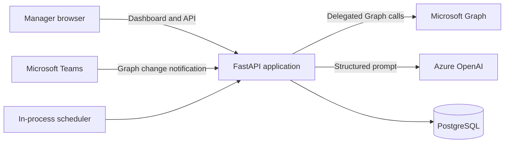
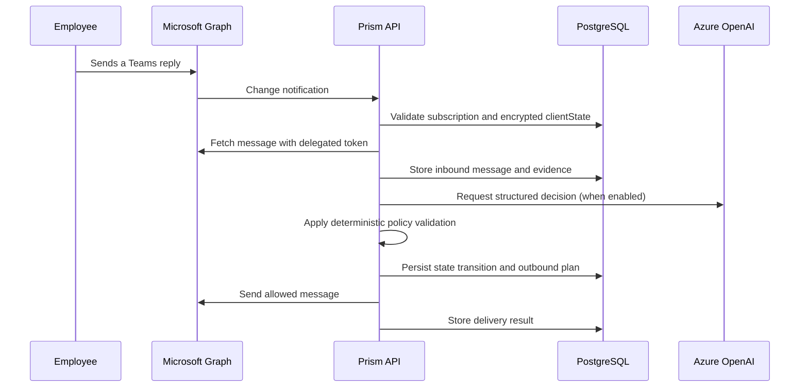

# Architecture

Prism is a self-hosted FastAPI application with a PostgreSQL system of record, a static
manager dashboard, Microsoft Graph integration, and optional Azure OpenAI analysis.

## System context

The API and scheduler share the same service layer and database. There is no separate queue
or worker service. Azure OpenAI is optional; PostgreSQL and the core management API are not.

## Components

- `app/api/routes`: HTTP transport, request validation, and response schemas.
- `app/services`: business rules, Microsoft Graph operations, automation, intelligence,
  memory, and deterministic validation.
- `app/agents`: construction and validation of bounded, structured AI decisions.
- `app/models`: SQLAlchemy models for operational state and audit history.
- `app/schemas`: Pydantic contracts for APIs and AI decisions.
- `app/static`: browser dashboard using the same APIs as external clients.
- `alembic`: the ordered PostgreSQL schema migration chain.

Routes should stay thin. Business rules belong in services, persistence contracts in models,
and external input validation in schemas.

## Teams reply flow

Chat text is untrusted data. Prompts explicitly prohibit it from overriding system rules,
and model output must conform to typed schemas and deterministic policies before mutations or
third-party messages are allowed.

## Storage model

PostgreSQL stores:

- employees, projects, tasks, daily updates, blockers, commitments, and escalations;
- conversations, inbound/outbound messages, delivery status, and automation runs;
- encrypted Microsoft access/refresh tokens and encrypted webhook `clientState` values;
- structured decision records, LLM usage, risks, attention items, and manager feedback;
- evidence-backed activity events, temporal facts, relationships, and episodes.

Operational records remain the current source of truth. Memory is supporting context and
retains source evidence; it must not silently override current state.

## Background processing

The optional scheduler is started in the FastAPI lifespan when
`AUTOMATION_SCHEDULER_ENABLED=true`. It runs in-process and opens a fresh database session for
each cycle. Deploy only one scheduler-enabled application process. A multi-replica deployment
requires separating scheduling or adding distributed leader election before enabling it.

Graph webhook processing returns quickly and schedules reply analysis as a FastAPI background
task. There is no durable external queue; the persisted inbound message and agent-run recovery
fields support bounded retry after process failure.

## Security boundaries

- Management APIs require `X-Manager-Operator-Token` when the application is public or is
  running outside development mode.
- OAuth uses a short-lived, one-time state value plus PKCE. Verifiers and Graph tokens are
  encrypted with the configured Fernet key.
- Graph webhook notifications are accepted only for a known active subscription with a
  constant-time `clientState` match.
- Automation targets only active, imported, explicitly managed employees in the active run.
- Tests prevent accidental live HTTP POST requests unless explicitly replaced with fakes.
- Health, OAuth callback, and webhook endpoints remain public because integrations require it.

The dashboard is static and can load without authentication; protected data is returned by the
API only after operator-token validation. Put production deployments behind HTTPS, request-size
limits, rate limiting, and network-level monitoring.

## External integrations

### Microsoft Graph

Prism uses delegated permissions to read/create direct chats, send messages and mail, import
directory users, and maintain change-notification subscriptions. Actions occur as the connected
manager account and are recorded locally.

### Azure OpenAI

Prism sends a bounded issue context and expects structured JSON. Usage metadata and estimated
costs are persisted. The application does not store or expose model chain-of-thought.

## Deployment constraints

- PostgreSQL is required; SQLite is not supported.
- Graph webhooks require a stable public HTTPS URL.
- A single API process may run the scheduler. Other API replicas must leave it disabled.
- The Fernet key must remain stable for the lifetime of encrypted Microsoft credentials.
- Database backups can contain employee communication and must be protected accordingly.
