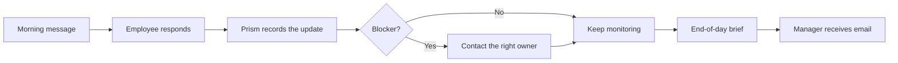

# Prism

Prism is a self-hosted management assistant for Microsoft Teams. It turns selected
one-to-one Teams conversations into structured updates, blockers, commitments,
follow-ups, management risks, and a daily manager brief while retaining an auditable
record of every automated action.

> **Project status:** pre-release. Prism is under active development and has not had an
> independent security audit. Automation is disabled by default; evaluate it in a
> non-production Microsoft tenant before using it with a real team.

## Why Prism exists

Team status is often spread across chat threads, verbal commitments, and private notes.
Prism provides a manager-controlled workflow that keeps those signals structured without
creating a separate employee-facing application. The manager chooses exactly which
directory users are in scope and explicitly starts or stops Teams automation.

## Capabilities

- Import active users from a Microsoft Entra ID tenant.
- Limit automation to explicitly selected managed people.
- Send Teams check-ins and process replies through Microsoft Graph webhooks.
- Track projects, tasks, blockers, commitments, escalations, and daily updates.
- Apply deterministic safety validation before AI-proposed state changes or messages.
- Preserve issue-scoped conversation evidence and organisational memory.
- Let managers save working preferences, decision guidance, and team context for the agent.
- Produce a five-section daily manager brief and send it through Microsoft Graph mail.
- Expose versioned FastAPI endpoints, OpenAPI documentation, and a local dashboard.
- Record Azure OpenAI token usage and configured cost estimates.

Prism uses delegated Microsoft permissions: messages and email are visibly sent from the
connected manager account. It is not a Teams bot or a multi-tenant SaaS service.

## Architecture

Prism is a Python 3.11 application built with FastAPI, SQLAlchemy, Alembic, PostgreSQL,
Microsoft Graph, and optional Azure OpenAI. The application serves both its JSON API and
static management dashboard. An optional in-process scheduler runs daily automation jobs.

See [ARCHITECTURE.md](ARCHITECTURE.md) for components, data flow, background processing,
and security boundaries.

### Daily operating flow

Prism runs a manager-controlled loop throughout the workday. Follow-ups stay limited to
employees selected for the active automation run; if a response names someone outside that
scope, Prism records the dependency and explains that it cannot contact them yet.



### What Prism includes

Prism combines daily communication automation with manager-defined context:

- **Manager memory:** Save useful facts, team context, working agreements, and recurring
  guidance in the dashboard.
- **Working style:** Record how the manager prefers updates, follow-ups, escalation, and
  decision summaries to be handled.
- **Decision guidance:** Add rules such as when to escalate, what evidence is needed, or
  who owns a particular type of decision.
- **Current work context:** Track projects, tasks, blockers, commitments, risks, and
  employee updates in PostgreSQL.
- **Context-aware responses:** When relevant, Prism supplies the saved guidance and current
  operational context while processing a reply. The current message and validated records
  remain the source of truth; saved memory does not silently override them.
- **Manager visibility:** Review conversations, agent actions, unresolved issues, follow-ups,
  and the end-of-day brief from the dashboard.

Manager memory is supporting context, not unrestricted instruction. Prism still applies
recipient-scope checks, structured decision validation, and audit logging before changing
state or sending a Teams message.

## Product screenshots

These screenshots show the main workflows available to a manager.

### Manager attention queue

The attention view highlights issues that may benefit from manager involvement. A manager
can review why an item is visible, see the expected next step, inspect the evidence, and
decide whether to wait for Prism's follow-up or intervene directly.


### Blocker resolution timeline: dependency follow-up

This timeline shows how Prism records a blocker, asks for the responsible owner, follows
up with that person, and marks the issue resolved when the dependency is delivered.


### Blocker resolution timeline: deployment dependency

Managers can review the full sequence of an employee's update, Prism's acknowledgement,
the dependency request, and the final resolution in one auditable view.


### Blocker resolution timeline: API dependency

When an employee names the person who owns a dependency, Prism can capture that owner and
send a focused follow-up requesting an expected completion time.


### Manager knowledge

The knowledge screen lets a manager save communication preferences, working agreements,
decision guidance, and other context. Prism can refer to this information when preparing
follow-ups and summaries.


### Teams automation controls

The Teams automation screen shows the connected account, managed employee scope, and
controls for starting automation, running a daily cycle, sending a digest, and renewing
the webhook listener.


## Local setup guide

This section takes you from a fresh checkout to a local Prism instance connected to
Microsoft Teams. Start with automation disabled, verify the dashboard, and only then expose
the webhook and message selected people.

### 1. Install prerequisites

You need:

- Python 3.11 or 3.12
- PostgreSQL 14 or newer
- GNU Make
- A Microsoft Entra ID tenant and permission to register an application
- ngrok or another stable public HTTPS tunnel for local Graph webhooks
- Azure OpenAI only if LLM-backed reply analysis is enabled

On macOS with Homebrew:

```bash
brew install python@3.11 postgresql@16 ngrok/ngrok/ngrok
brew services start postgresql@16
```

On Linux, install the same packages through your distribution package manager. Docker
Compose is an alternative to installing Python and PostgreSQL locally; see [Run with
Docker](#run-with-docker).

### 2. Clone Prism and create a Python environment

```bash
git clone https://github.com/oneclarity-ai/prism.git
cd prism
cp .env.example .env
python3.11 -m venv .venv
source .venv/bin/activate
python -m pip install --upgrade pip
python -m pip install -r requirements-dev.txt
```

If your shell does not support `source`, activate the environment using the equivalent
command for your platform. Every later command using `python`, `alembic`, or `uvicorn`
should run with `.venv` activated.

### 3. Create or connect to PostgreSQL

For a new local database:

```bash
createuser --pwprompt prism
createdb --owner=prism prism
```

Set this value in `.env`:

```dotenv
DATABASE_URL=postgresql+psycopg://prism:<password>@localhost:5432/prism
```

If the database already exists, keep it and only point `DATABASE_URL` at it. Do not run
integration tests against a database containing useful data; use a separate test database.

### 4. Configure safe local defaults

Open `.env` and generate the two local secrets:

```bash
python -c "import secrets; print(secrets.token_urlsafe(32))"
python -c "from cryptography.fernet import Fernet; print(Fernet.generate_key().decode())"
```

Put the first output in `OPERATOR_API_TOKEN` and the second in
`MICROSOFT_TOKEN_ENCRYPTION_KEY`. Keep these values private and stable. Changing the
Fernet key later makes already-stored Microsoft tokens unreadable.

Keep these settings while doing the initial setup:

```dotenv
APP_ENV=development
INTELLIGENCE_LLM_ENABLED=false
AUTOMATION_SCHEDULER_ENABLED=false
MICROSOFT_WEBHOOK_BASE_URL=
```

Leave the Microsoft and Azure OpenAI values blank until the corresponding setup steps are
complete. Never commit `.env`.

### 5. Run migrations and start Prism

```bash
make migrate
make dev
```

Open these URLs in the same computer:

- Dashboard: <http://127.0.0.1:8000/dashboard/>
- OpenAPI documentation: <http://127.0.0.1:8000/docs>
- Health check: <http://127.0.0.1:8000/health>
- Database health check: <http://127.0.0.1:8000/health/db>

At this stage, the dashboard and core API should work without Microsoft credentials. Do not
start automation yet.

### 6. Register the Microsoft Entra application

Prism uses delegated Microsoft Graph permissions. Messages and email are sent as the
connected manager account; Prism does not use an application identity to impersonate every
user.

In the [Microsoft Entra admin center](https://entra.microsoft.com/):

1. Open **Identity > Applications > App registrations** and select **New registration**.
2. Give the app a local name such as `Prism Local`.
3. Choose **Accounts in this organizational directory only** (single tenant).
4. Under **Redirect URI**, choose **Web** and add:

   ```text
   http://localhost:8000/api/v1/microsoft/auth/callback
   ```

5. Select **Register** and copy the **Application (client) ID** and **Directory (tenant) ID**.
6. Open **Certificates & secrets**, create a **new client secret**, and copy its **Value**
   immediately. Do not use the secret ID; Prism needs the secret value.
7. Open **API permissions > Add a permission > Microsoft Graph > Delegated permissions**.
8. Add these permissions:

   ```text
   User.Read
   User.Read.All
   Chat.Create
   Chat.Read
   ChatMessage.Send
   Mail.Send
   ```

   Prism also requests the standard `openid`, `profile`, and `offline_access` scopes during
   sign-in so it can identify the connected account and refresh delegated access.
9. Select **Grant admin consent** if your tenant requires administrator approval. Confirm
   that the permissions show a green consent status.

Microsoft’s official references are [Register an application](https://learn.microsoft.com/en-us/graph/auth-register-app-v2),
[Graph permissions](https://learn.microsoft.com/en-us/graph/permissions-reference), and
[redirect URI guidance](https://learn.microsoft.com/en-us/entra/identity-platform/reply-url).

Copy the values into `.env`:

```dotenv
MICROSOFT_TENANT_ID=<directory-tenant-id>
MICROSOFT_CLIENT_ID=<application-client-id>
MICROSOFT_CLIENT_SECRET=<client-secret-value>
MICROSOFT_REDIRECT_URI=http://localhost:8000/api/v1/microsoft/auth/callback
```

Restart Prism after changing `.env`.

### 7. Connect the manager account

1. Open the dashboard and select **Connect Microsoft account**.
2. Sign in with the manager account that should send Teams messages and email.
3. Accept the requested delegated permissions.
4. Confirm that the dashboard shows the connected display name and email.

If Microsoft shows `AADSTS50011`, the redirect URI in Entra does not exactly match
`MICROSOFT_REDIRECT_URI`, including the scheme, hostname, path, and trailing slash behavior.
If consent is denied, ask a tenant administrator to grant the configured permissions.

### 8. Import people and choose the managed scope

From the Teams automation panel:

1. Select **Import active directory users**.
2. Review the imported directory list.
3. Add only the people Prism is allowed to manage.
4. Confirm that the managed-people count is correct.

Importing the directory does not send messages. Starting automation sends the first check-in
only to the explicitly selected managed people.

### 9. Expose the local webhook with ngrok

Microsoft Graph must reach Prism over a public HTTPS URL. Keep Prism running on port `8000`
and open a second terminal:

```bash
ngrok config add-authtoken <your-ngrok-auth-token>
ngrok http 8000
```

Copy the HTTPS forwarding address, for example:

```text
https://example.ngrok-free.app
```

Set only the public origin—without a trailing slash—in `.env`:

```dotenv
MICROSOFT_WEBHOOK_BASE_URL=https://example.ngrok-free.app
OPERATOR_API_TOKEN=<the-same-random-token-generated-earlier>
```

Restart Prism after changing the URL. Prism will create the webhook endpoint at:

```text
https://example.ngrok-free.app/api/v1/microsoft/teams/webhook
```

The dashboard’s management APIs are protected whenever a webhook URL is configured. Click
the key icon in the dashboard and enter the same `OPERATOR_API_TOKEN` value. The token is
stored in that browser’s local storage and sent as `X-Manager-Operator-Token`.

The default free ngrok URL can change whenever ngrok restarts. If it changes, stop Prism
automation, update `MICROSOFT_WEBHOOK_BASE_URL`, restart Prism, and start automation again so
the Graph subscription points to the new URL. A stable reserved domain or deployed HTTPS
endpoint is recommended for anything beyond local testing.

### 10. Start and verify automation

Before starting, verify:

- Microsoft account is connected.
- The intended people are the only managed people.
- ngrok is running and forwards to port `8000`.
- `MICROSOFT_WEBHOOK_BASE_URL` has no trailing slash.
- The operator token is entered in the dashboard.
- You are testing with people who have agreed to receive the messages.

Select **Start automation**. Prism sends the initial Teams message only to the selected
managed people and creates reply listeners for their direct conversations.

Use this safe first test:

1. Select one test employee.
2. Start automation.
3. Confirm that employee receives the check-in.
4. Reply with a normal work update and confirm Prism acknowledges it.
5. Reply with a synthetic blocker that names another selected employee.
6. Confirm Prism contacts that owner and records the dependency.
7. Stop automation immediately after the test if you do not want scheduled messages.

If the named owner is not part of the active managed run, Prism records the dependency and
tells the source employee that the owner cannot be contacted in the current run.

### 11. Enable scheduled daily automation

After the manual test succeeds, set the schedule in `.env`:

```dotenv
AUTOMATION_SCHEDULER_ENABLED=true
MANAGER_TIMEZONE=Asia/Kolkata
DAILY_CHECKIN_TIME=10:00
DAILY_FOLLOWUP_TIME=13:00
DAILY_DIGEST_TIME=19:30
```

Restart Prism. The scheduler runs inside the API process, so enable it in only one process.
It performs morning check-ins, follow-ups, listener renewal, memory consolidation, and the
end-of-day five-section brief.

The digest email is sent to the connected manager account. `MANAGER_NOTIFICATION_EMAIL` is
optional and is used for configured manager alert routing; it is not required for the normal
connected-account digest.

You can send a one-time digest from the dashboard’s **Send digest** button. Use **Run daily
cycle** only for controlled testing because it can trigger due automation actions.

### 12. Add manager memory and working preferences

Open the dashboard’s memory and knowledge areas to record:

- How the manager prefers updates to be written.
- What evidence is needed before escalating an issue.
- How blockers and ownership should be handled.
- Team working agreements and recurring context.
- Decision ownership and escalation guidance.

Prism supplies relevant saved context when processing replies. Current messages, explicit
managed scope, database state, and deterministic validation remain authoritative; saved
memory cannot directly authorize an out-of-scope message.

### 13. Enable Azure OpenAI analysis (optional)

Prism can run without Azure OpenAI. Enable it only after the deterministic Teams workflow is
working:

```dotenv
INTELLIGENCE_LLM_ENABLED=true
AZURE_OPENAI_ENDPOINT=https://<resource-name>.openai.azure.com
AZURE_OPENAI_API_KEY=<key>
AZURE_OPENAI_DEPLOYMENT=<chat-deployment-name>
AZURE_OPENAI_REASONING_DEPLOYMENT=
AZURE_OPENAI_API_VERSION=2024-10-21
```

The deployment names must match deployments in your Azure OpenAI resource. Restart Prism
after changing these values. `LLM_MODEL_PRICING` is optional and is used only to estimate
costs in the dashboard; leave it as `{}` if you do not want cost estimates.

Do not place Azure keys in the README, issue reports, screenshots, browser storage, or Git.
Use a managed secret store for anything beyond local development.

### 14. Troubleshooting

**`ERR_NGROK_8012` or “connection refused”**

The ngrok agent is running, but Prism is not reachable at the forwarded address. Confirm that
Prism is running on port `8000`, that ngrok uses `ngrok http 8000`, and that the forwarding
address in `MICROSOFT_WEBHOOK_BASE_URL` matches the currently running tunnel.

**Dashboard returns `401` or `503` for management actions**

Click the dashboard key icon and enter the exact value of `OPERATOR_API_TOKEN`. A `503`
usually means a public webhook URL or non-development `APP_ENV` is configured but the token
is blank. Restart Prism after changing `.env`.

**Microsoft returns `AADSTS50011`**

The redirect URI is not an exact match. Check the Entra Web redirect URI and
`MICROSOFT_REDIRECT_URI` character by character. For same-computer local development, use:

```text
http://localhost:8000/api/v1/microsoft/auth/callback
```

**Automation starts but replies are not processed**

Confirm that ngrok is still running, the public webhook URL is current, automation is active,
and the listener has not expired. Use **Renew listener** for a controlled test, or stop and
start automation after changing the ngrok URL. Check the dashboard activity and delivery-health
sections for failed runs.

**Only one person receives a message**

That is expected when only one person is in the managed list at the time automation starts.
Importing people does not add them to the managed scope; add them explicitly before starting
the next run.

**The daily email is not received**

Confirm the connected Microsoft account, `Mail.Send` delegated permission, the configured
timezone and `DAILY_DIGEST_TIME`, and that the scheduler is enabled in exactly one Prism
process. Use **Send digest** once to test email delivery independently of the schedule.

**Database connection errors**

Confirm PostgreSQL is running, the database exists, the credentials in `DATABASE_URL` are
correct, and migrations have been applied with `make migrate`.

## Run with Docker

```bash
cp .env.example .env
# Set a unique local-only database password in .env before continuing.
# For example: PRISM_DATABASE_PASSWORD=choose-a-long-local-password
docker compose up --build
```

Compose starts PostgreSQL, applies Alembic migrations, and starts Prism on port `8000`.
Compose deliberately refuses to start until `PRISM_DATABASE_PASSWORD` is set in `.env`.
Choose a unique local password; do not use a default value or commit `.env`.

Stop the services with `docker compose down`. Add `--volumes` only when you intentionally
want to delete the local PostgreSQL data volume.

## Configuration

All configuration is read from environment variables or an ignored `.env` file. The
complete, commented list is in [.env.example](.env.example).

| Variable | Purpose | Default/safe state |
| --- | --- | --- |
| `APP_ENV` | Runtime environment; non-development modes require operator authentication | `development` |
| `DATABASE_URL` | PostgreSQL SQLAlchemy URL | Required |
| `MANAGER_TIMEZONE` | Interprets scheduled times and incomplete employee ETAs | `UTC` |
| `AGENT_SIGNATURE` | Signature appended to automated Teams messages | `Sent by Prism` |
| `OPERATOR_API_TOKEN` | Protects management APIs through `X-Manager-Operator-Token` | Required when public |
| `MICROSOFT_*` | Entra OAuth, token encryption, and webhook configuration | Disabled when blank |
| `INTELLIGENCE_LLM_ENABLED` | Enables Azure OpenAI-backed analysis | `false` in the example |
| `AZURE_OPENAI_*` | Azure OpenAI endpoint, key, API version, and deployments | Disabled when blank |
| `AUTOMATION_SCHEDULER_ENABLED` | Runs scheduled automation inside the API process | `false` |
| `DAILY_*_TIME` | Daily check-in, follow-up, and digest times | See `.env.example` |
| `MANAGER_NOTIFICATION_EMAIL` | Optional directory target for manager alerts | Blank |
| `MEMORY_*` | Organisational-memory limits and consolidation | Conservative defaults |

Generate local secret values without storing them in shell history manually:

```bash
python -c "import secrets; print(secrets.token_urlsafe(32))"
python -c "from cryptography.fernet import Fernet; print(Fernet.generate_key().decode())"
```

Never commit `.env`. Changing `MICROSOFT_TOKEN_ENCRYPTION_KEY` without reauthorizing the
Microsoft connection makes stored tokens unreadable.

## Microsoft Graph behavior

Every Graph notification is matched to an active subscription and validated with its
encrypted `clientState` before Prism fetches or stores the message. Graph subscriptions are
renewed periodically while automation is running; the dashboard also exposes a manual
listener-renewal action for controlled testing.

For production, use a stable HTTPS deployment and a managed secret store. An ngrok tunnel is
intended for local development and testing, not as a production deployment strategy.

## API and authentication

The main API groups are:

- `/api/v1`: employees, projects, tasks, daily updates, blockers, commitments,
  conversations, escalations, memory, Microsoft integration, and usage.
- `/api/v2/management`: aggregated management state, dependency graph, risks, decisions,
  attention, daily briefs, changes, feedback, and bounded queries.

When `APP_ENV` is not `development`, or a public webhook URL or operator token is set,
management APIs require this header:

```http
X-Manager-Operator-Token: <OPERATOR_API_TOKEN>
```

Health checks, Microsoft OAuth callbacks, and the Graph webhook remain public by design.
Domain errors use a stable JSON body with `detail` and `code` fields. Consult `/docs` for
the generated request and response schemas.

## Background jobs

The optional scheduler performs check-ins, follow-ups, listener renewal, daily briefs, and
memory consolidation. It is off by default. The scheduler runs inside the API process, so
enable it in only one process or replica; multiple scheduler-enabled workers can contend for
the same jobs even though outbound actions use idempotency keys.

## Testing and quality

```bash
make check          # lint, formatting check, type checking, unit tests, secret patterns
make test           # fast tests; PostgreSQL tests are skipped
make test-integration
make audit          # dependency vulnerability audit; requires network access
```

Integration tests use `DATABASE_URL` and can modify that database. Always point them at a
dedicated test database—never a development or production database.

Tests block live HTTP POST requests by default. Microsoft Graph and Azure OpenAI boundaries
must be mocked unless a deliberately isolated live acceptance test is being performed.

## Database migrations

```bash
make migrate
.venv/bin/alembic current
.venv/bin/alembic history
```

Create schema changes with Alembic and include both upgrade and downgrade behavior. Do not
edit an already published migration once external installations may have applied it.

## Project structure

```text
app/
  agents/       Structured AI decision prompts and orchestration
  api/routes/   FastAPI route groups
  core/         Configuration and request security
  db/           SQLAlchemy engine and sessions
  models/       PostgreSQL ORM models
  schemas/      API and decision validation models
  services/     Business logic and external integrations
  static/       Manager dashboard
alembic/        Database migration chain
scripts/        Repository maintenance checks
tests/          Unit and opt-in PostgreSQL integration tests
.github/        Contribution templates and CI/security automation
```

## Contributing

Read [CONTRIBUTING.md](CONTRIBUTING.md) before opening a pull request. Changes should remain
small, preserve the deterministic safety layer around AI decisions, and include regression
tests for message sending, authorization, data integrity, or migration behavior they affect.

## Security

Do not report vulnerabilities in a public issue. Follow [SECURITY.md](SECURITY.md) to open a
private GitHub security advisory. Prism handles employee messages and delegated Microsoft
tokens, so deployments should use isolated infrastructure, encrypted backups, HTTPS, a strong
operator token, and a managed secret store.

## Roadmap and support

See [ROADMAP.md](ROADMAP.md) for near-term priorities and [SUPPORT.md](SUPPORT.md) for support
boundaries. Changes are recorded in [CHANGELOG.md](CHANGELOG.md).

## Licence

Prism is licensed under the [MIT License](LICENSE).
